# 🎥 YutubuDownload  
### *Tanzania-Optimized YouTube Downloader for Ubuntu Terminal*  

> “Out here doing some Alien things, Jesus is King...” — Johnbosco (Isaiah 28:21)

<div align="center">

```
█████ █████             █████               █████                ██████████                                       ████                         █████
░░███ ░░███             ░░███               ░░███                ░░███░░░░███                                     ░░███                        ░░███ 
 ░░███ ███   █████ ████ ███████   █████ ████ ░███████  █████ ████ ░███   ░░███  ██████  █████ ███ █████ ████████   ░███   ██████   ██████    ███████ 
  ░░█████   ░░███ ░███ ░░░███░   ░░███ ░███  ░███░░███░░███ ░███  ░███    ░███ ███░░███░░███ ░███░░███ ░░███░░███  ░███  ███░░███ ░░░░░███  ███░░███ 
   ░░███     ░███ ░███   ░███     ░███ ░███  ░███ ░███ ░███ ░███  ░███    ░███░███ ░███ ░███ ░███ ░███  ░███ ░███  ░███ ░███ ░███  ███████ ░███ ░███ 
    ░███     ░███ ░███   ░███ ███ ░███ ░███  ░███ ░███ ░███ ░███  ░███    ███ ░███ ░███ ░░███████████   ░███ ░███  ░███ ░███ ░███ ███░░███ ░███ ░███ 
    █████    ░░████████  ░░█████  ░░████████ ████████  ░░████████ ██████████  ░░██████   ░░████░████    ████ █████ █████░░██████ ░░████████░░████████
   ░░░░░      ░░░░░░░░    ░░░░░    ░░░░░░░░ ░░░░░░░░    ░░░░░░░░ ░░░░░░░░░░    ░░░░░░     ░░░░ ░░░░    ░░░░ ░░░░░ ░░░░░  ░░░░░░   ░░░░░░░░  ░░░░░░░░ 
```

**Author:** Johnbosco | **Last Updated:** February 10, 2026  
**Version:** v1.1.6 — *Clean Progress Bar Edition*  
🌍 *Tested across Dar es Salaam, Mwanza, Arusha & Zanzibar networks*  

[](https://github.com/johnboscocjt/Youtube-Downloader-For-UbuntuTerminal)  
[](https://github.com/johnboscocjt/Youtube-Downloader-For-UbuntuTerminal/releases/tag/v1.1.6)
[](LICENSE)

</div>

> 💡 **Zsh users**: After install, run `source ~/.zshrc` once  
> 🌍 **Tanzania Tip**: Run during off-peak hours (after 10 PM EAT) for faster downloads!

---

## 🆕 What's New in v1.1.6?

### ✨ **CLEAN PROGRESS BAR DISPLAY**
- **Fixed**: No more messy, overlapping progress bar output
- **Enhanced**: Single-line progress bar with clean updates
- **Added**: File size display in real-time
- **Format**: `Title VideoID ████████████████████░ 100.0% | 2.98MiB | ETA: 00:00 | 1.68MiB/s`
- **Completion**: Clean download confirmation: `✓ Downloaded: Title [2.98MiB]`

### 📊 **Enhanced Visual Feedback**
- **Video ID Display**: Shows first 8 characters next to title
- **Real-time File Size**: See download size as it progresses
- **Color-coded Elements**: Consistent terminal coloring
- **Smooth Updates**: Proper carriage returns for single-line updates

---

## 🌌 Alien-Tech Terminal Experience

YutubuDownload now features **professional terminal interface** with:
- 🔵 **Clean single-line progress updates** for distraction-free downloading
- 📊 **Real-time file size display** so you know what to expect
- 🟡 **Video ID identification** for easy tracking
- ✨ **Faith-powered closing flourish**

Your terminal doesn’t just download — it **declares Kingdom authority over the digital realm**.

---

## ⚡ One-Command Installation (Recommended)

```bash
# Installs ALL dependencies + script globally (run once)
sudo bash -c "$(curl -sL https://raw.githubusercontent.com/johnboscocjt/Youtube-Downloader-For-UbuntuTerminal/main/install.sh)"
```

---

## 🚀 Quick Start

```bash
# 1. CLOSE ALL CHROME WINDOWS COMPLETELY (required for cookie access)
# 2. Open terminal and run:
cd ~/youtubedownloading
YutubuDownload

# 3. Follow prompts:
#    • Paste YouTube URL
#    • Choose: Video or MP3
#    • Select quality (720p recommended for unstable networks)
#    • Confirm folder (recommended for playlists)
```

✅ **Done!** Files saved with resume support & no duplicates.

---

## ✨ Key Features

- **🇹🇿 Tanzania-Optimized**  
  Resume support for unstable 4G networks (Vodacom/Airtel/Tigo)
  
- **📊 Clean Progress Display**  
  Single-line progress bar with file size, ETA, and speed (v1.1.6)
  
- **🛡️ Bot-Bypass Technology**  
  Uses Chrome cookies + user-agent spoofing to avoid "Sign in to confirm you're not a bot" errors
  
- **📁 Smart Organization**  
  Playlists saved as `Title [PLAYLIST_ID]` to prevent mixing same-name playlists (common with Bongo Flava compilations!)
  
- **🎵 Flexible Output**  
  Video (any resolution) or MP3 (320kbps/192kbps/128kbps)
  
- **💾 Data-Saving**  
  Never re-downloads completed videos are tracked 
  
- **⚡ Deno-Powered**  
  Solves YouTube's 2026 JavaScript challenges for full quality access

---

## 🔧 Manual Installation (Alternative)

```bash
# 1. Install dependencies
sudo apt update && sudo apt install -y ffmpeg python3-venv python3-pip
sudo curl -L https://github.com/yt-dlp/yt-dlp/releases/latest/download/yt-dlp -o /usr/local/bin/yt-dlp && sudo chmod a+rx /usr/local/bin/yt-dlp
curl -fsSL https://deno.land/install.sh | sh && echo 'export PATH="$HOME/.deno/bin:$PATH"' >> ~/.bashrc && source ~/.bashrc

# 2. Setup Python venv for cookies
mkdir -p ~/youtubedownloading && cd ~/youtubedownloading
python3 -m venv yt-venv && source yt-venv/bin/activate && pip install secretstorage cryptography && deactivate

# 3. Install script
sudo curl -sL https://raw.githubusercontent.com/johnboscocjt/Youtube-Downloader-For-UbuntuTerminal/main/YutubuDownload -o /usr/local/bin/YutubuDownload && sudo chmod +x /usr/local/bin/YutubuDownload
```

---

## 📚 Full Documentation

For detailed setup, troubleshooting, and advanced usage:  
👉 **[Complete Documentation](https://github.com/johnboscocjt/Youtube-Downloader-For-UbuntuTerminal/blob/main/YTdownloadScriptForVideoPlaylistAudio.md)**

---

## 🔁 How to Update

```bash
# One command to update to latest version
sudo bash -c "$(curl -sL https://raw.githubusercontent.com/johnboscocjt/Youtube-Downloader-For-UbuntuTerminal/main/install.sh)"
```

## OR Manual Update to v1.1.6:
```bash
# Fetch latest version
sudo curl -sL https://raw.githubusercontent.com/johnboscocjt/Youtube-Downloader-For-UbuntuTerminal/main/YutubuDownload -o /usr/local/bin/YutubuDownload
sudo chmod +x /usr/local/bin/YutubuDownload

# Check version
YutubuDownload --version
# Should show: YutubuDownload v1.1.6 (2026-02-10) • Tanzania-Optimized • CLEAN PROGRESS BAR
```

---

## 📸 Screenshots

<div align="center">
  
### **1. New Clean Progress Bar (v1.1.6)**

*Single-line progress with file size and ETA*

### **2. Terminal Interface & Main Menu**


### **3. URL Input & Processing**


### **4. Format Selection (Video/MP3)**


### **5. Quality Selection & Download Progress**


### **6. Completion & File Organization**

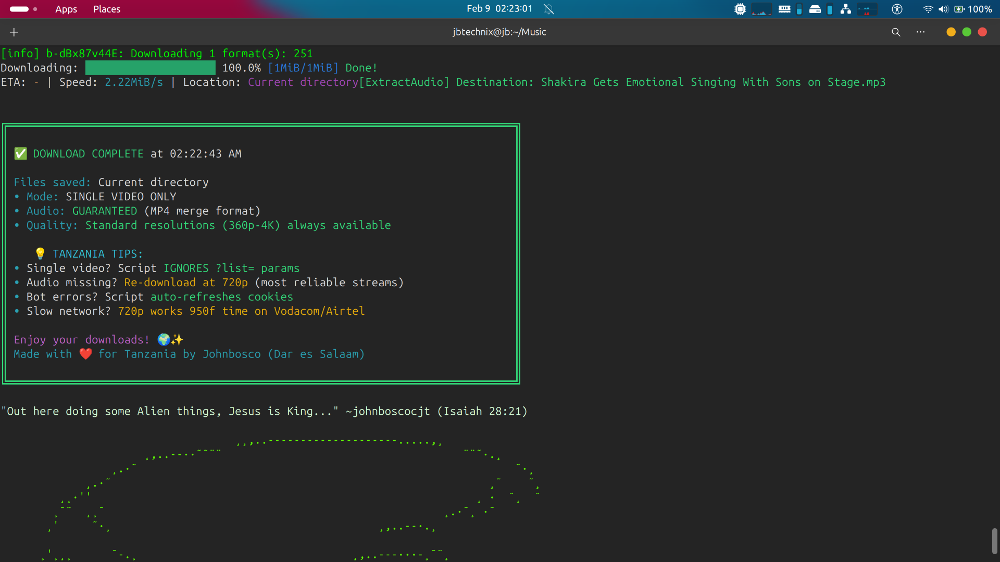
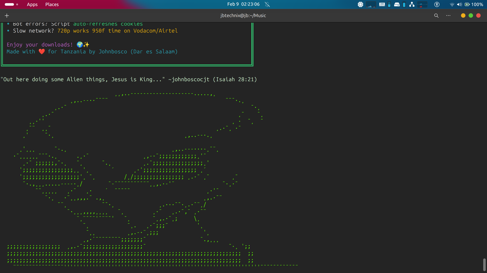

<br />

### **NOTE : Some times it will fail to download because of the 1.Time you are using, 2.WiFi/Network you are using, 3.New BOT block**
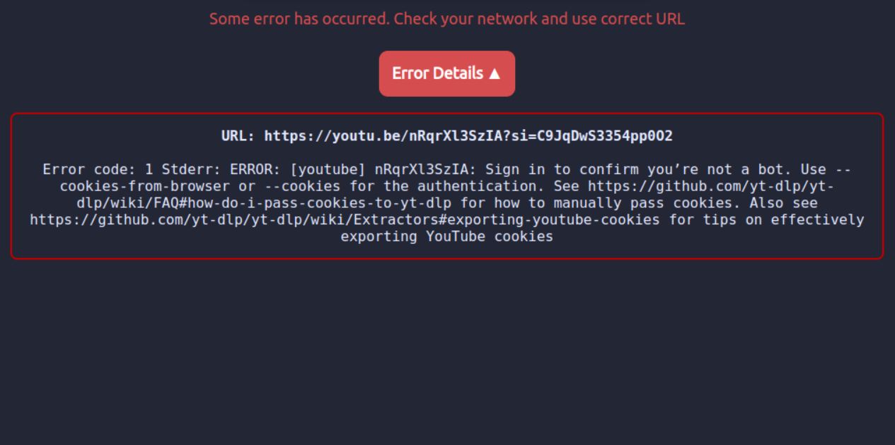
### **SOLUTION : Use Mobile Data by hotspotting your pc from your phone, Keep trying, close and re-open terminal, Kill chrome sessions or even close browsers, Find Ethernet and use it for downloading**

<br />

### **7. New Version : v1.1.6**
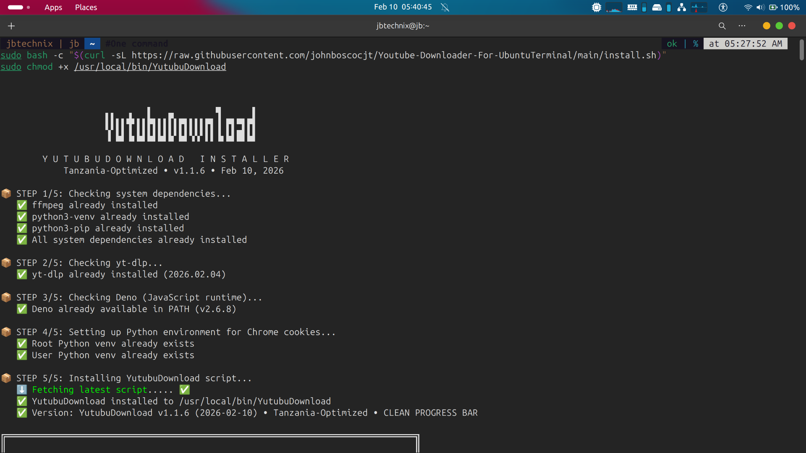
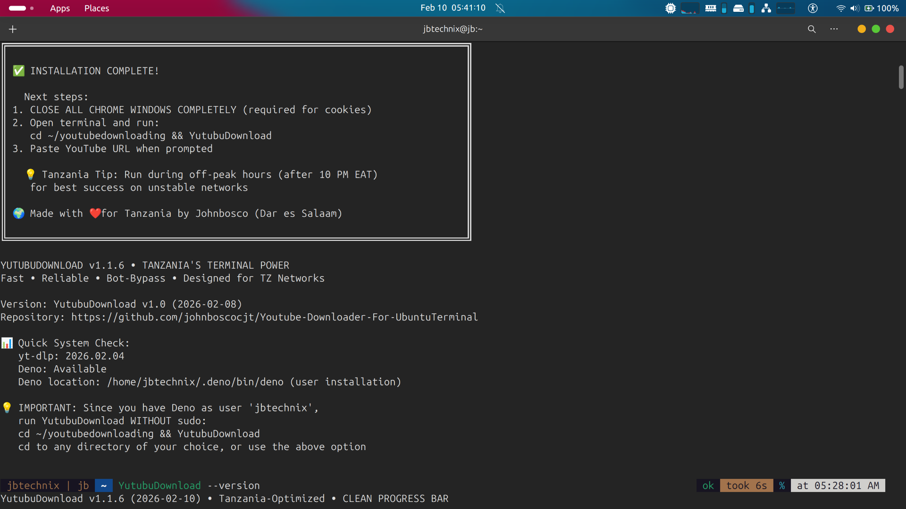
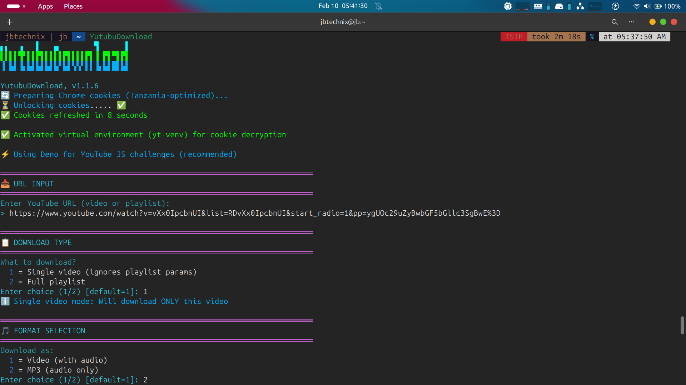
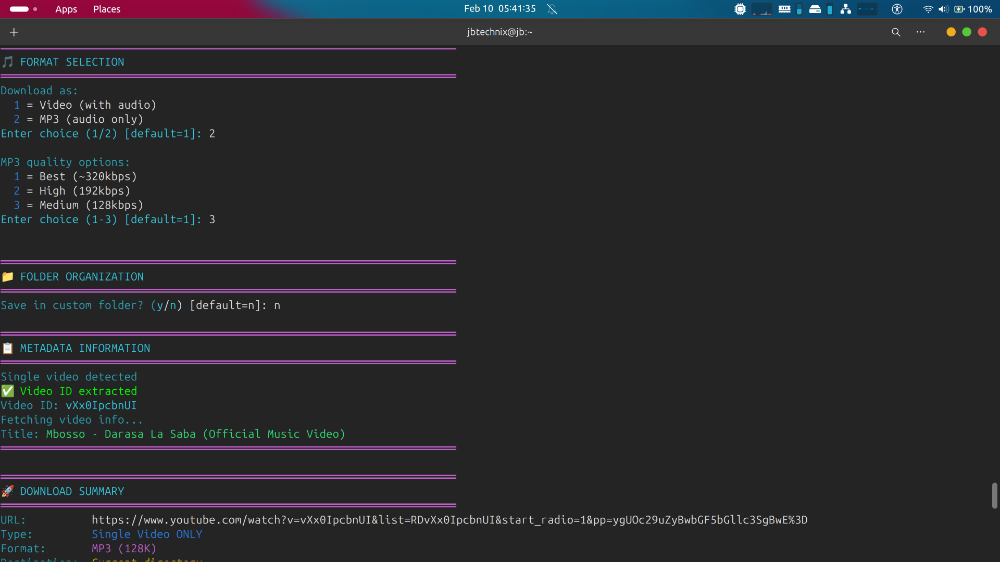
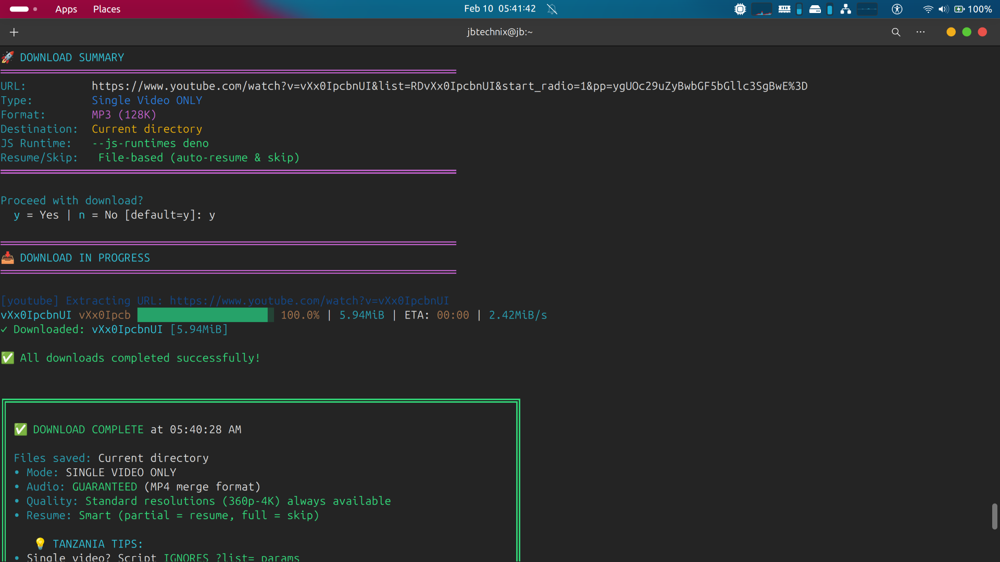
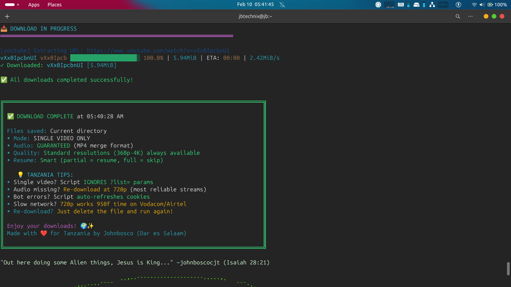
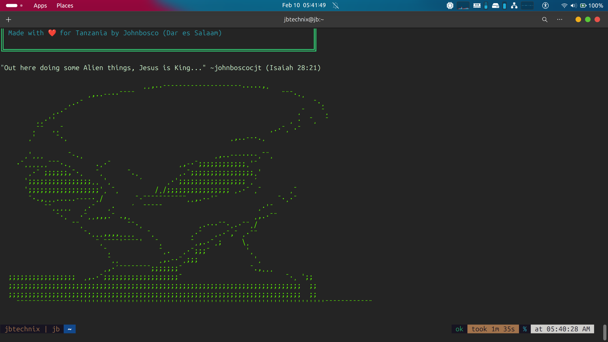
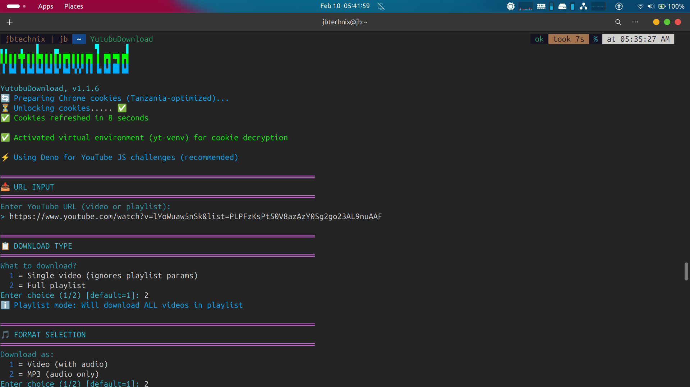
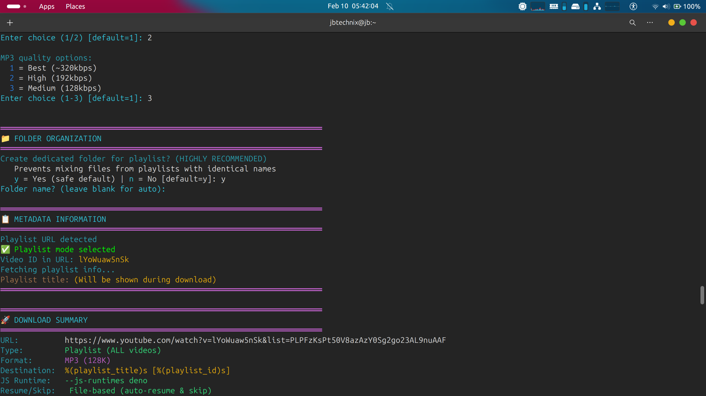
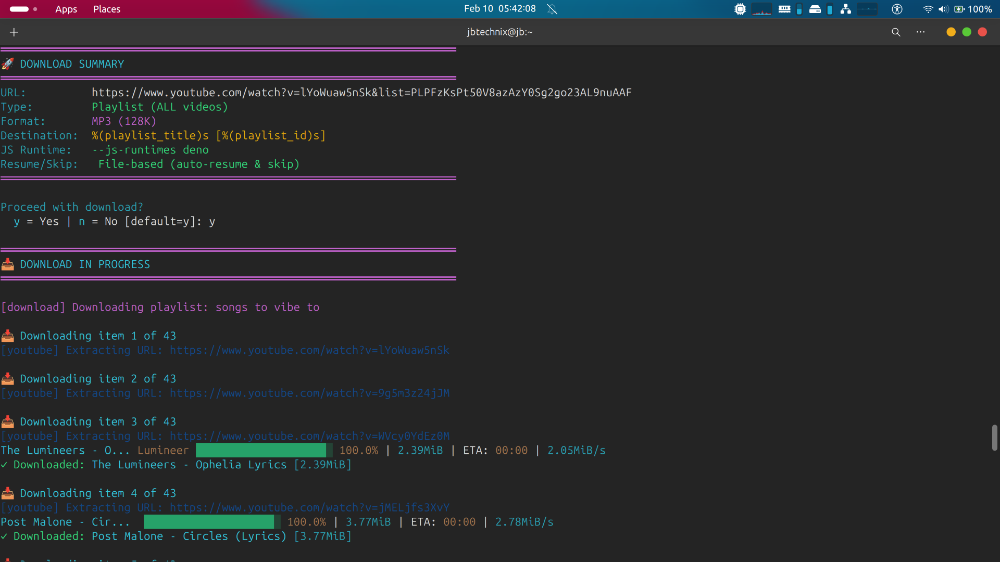
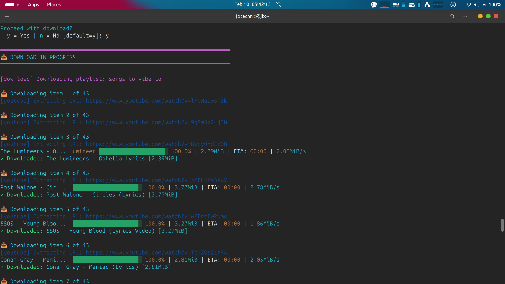


</div>

---

## 📋 Changelog

### v1.1.6 (2026-02-10)
- **Fixed**: Progress bar display - now shows single clean line
- **Added**: File size display in progress bar
- **Added**: Video ID (short) in progress display
- **Improved**: Terminal output formatting
- **Optimized**: Tanzania network compatibility

### v1.1.5 (2026-02-10)
- **Added**: File size to progress bar output
- **Fixed**: EOF error in folder organization

### v1.1.4 (2026-02-10)
- **Fixed**: Color codes and banner display
- **Added**: Metadata display before download

### v1.1.0 (2026-02-09)
- **Initial**: Tanzania-optimized YouTube downloader

---

## ❓ Why Built for Tanzania?

> *"As a developer in Dar es Salaam, I created YutubuDownload to solve real problems Tanzanian users face daily:*  
> - *Mobile data is expensive → resume support saves money after disconnects*  
> - *Same-name playlists everywhere → ID-based folders prevent chaos*  
> - *YouTube aggressively blocks Tanzanian IPs → cookie + user-agent bypass works*  
> - *Power cuts interrupt downloads → archive tracking prevents duplicates*  
> *Tested on Vodacom 4G in Kariakoo, Airtel in Mwanza, and slow hotel Wi-Fi in Zanzibar."*  
> **— Johnbosco, Creator (February 2026)**

---

## 🚀 Future Roadmap
- [ ] Parallel download support
- [ ] Download queue management  
- [ ] Automatic quality selection based on network speed
- [ ] GUI wrapper option
- [ ] Mobile app companion

---

## 🤝 Support & Contribution

🐞 **Found a bug?** → [Open GitHub Issue](https://github.com/johnboscocjt/Youtube-Downloader-For-UbuntuTerminal/issues)  
💡 **Have an idea?** → Pull requests welcome!  
💬 **Tanzanian user community**: Join discussions on GitHub  

<div align="center">
  
⭐ **If this saves you time/data in Tanzania, please star the repo!**  
[](https://github.com/johnboscocjt/Youtube-Downloader-For-UbuntuTerminal)  

**"YutubuDownload v1.1.6: Because clean progress bars matter when you're counting every megabyte in Tanzania"**  
— Johnbosco, Dar es Salaam 🇹🇿  

</div>
